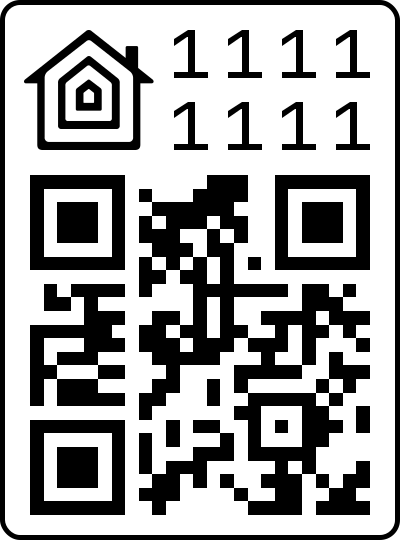
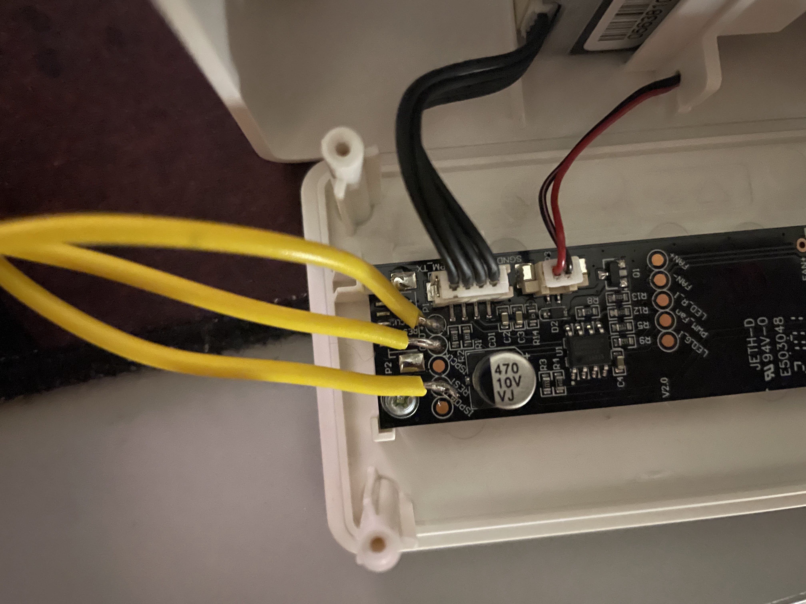
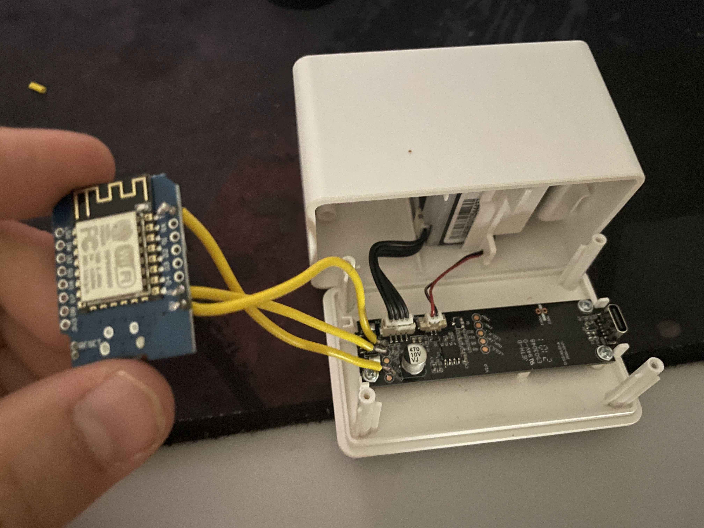

<h2>Apple HomeKit for IKEA VINDRIKTNING PM2.5 Air Quality sensor</h2>

ESP8266 firmware, for IKEA VINDRIKTNING PM2.5 Air Quality sensor.
The modification doesn't interfere with normal operation of the device in any way.
The ESP8266 just adds another data sink beside the colored LEDs.

This Firmware is Frenkestein Monster between MQTT ESP8266 IKEA VINDRIKTNING Firmware from Hypfer and ESP8266 HomeKit implementation from Mixiaoxiao. 
Its my first project in C for ESP8266, so dont expect any warranties. But it works on mine device. 
I am not liable for any damage to your devices. If you use this firmware, it's your own risk.

## Prerequisites

To extend your air quality sensor, you will need

- An ESP8266 with a 5v voltage regulator (e.g. a Wemos D1 Mini)
- Some short dupont cables
- A soldering iron
- A long PH0 Screwdriver (e.g. Wera 118022)

Fortunately, there is a lot of unused space in the enclosure, which is perfect for our ESP8266.
Also, everything we need is accessible via easy to solder testpoints.

## Hardware

To install the ESP8266, you need to unscrew the four visible screws in the back of the enclosure.

Then, there are also three screws holding the tiny PCB in place. These aren't necessary to remove since you can solder
in-place, however personally, I'd recommend taking the board out of there since it will be easier to solder without fear
of accidentally melting some plastic.

As you can see in this image, you'll need to solder wires to GND, 5V and the Testpoint that is connected to TX of the
Particle Sensor.

Then just connect these Wires to GND, VIN (5V) and D2 (if you're using a Wemos D1 Mini).

Done.

## Software

The firmware can be built and flashed using the Arduino IDE.

For this, you will need to add ESP8266 support to it by [using the Boards Manager](https://github.com/esp8266/Arduino#installing-with-boards-manager).

1. Go to this GitHub repo and download it as ZIP - https://github.com/Mixiaoxiao/Arduino-HomeKit-ESP8266
2. In Arduino IDE select "Sketch" -> "Include Library" and "Add .ZIP Library..." and select downloaded ZIP
3. Download and open this repository in Arduino IDE
4. Open wifi_info.ha and replace ssid and password with yours
5. Set the ESP8266 CPU to run at 160MHz
3. Build, flash, and you're done.

## References and sources

- [@Hypfer](https://twitter.com/hypfer?lang=en) for MQTT ESP8266 VINDRIKTNING custom firmware [GitHub link](https://github.com/Hypfer/esp8266-vindriktning-particle-sensor)
- [@Mixiaoxiao](https://twitter.com/haxfleisch) for ESP8266 HomeKit firmware [GitHub link](https://github.com/Mixiaoxiao/Arduino-HomeKit-ESP8266)
- [@haxfleisch](https://twitter.com/haxfleisch) for their teardown of the device.
- [Gabriel Valky](https://github.com/gabonator) for the incredibly useful [LA104 custom firmware + tools](https://github.com/gabonator/LA104)
